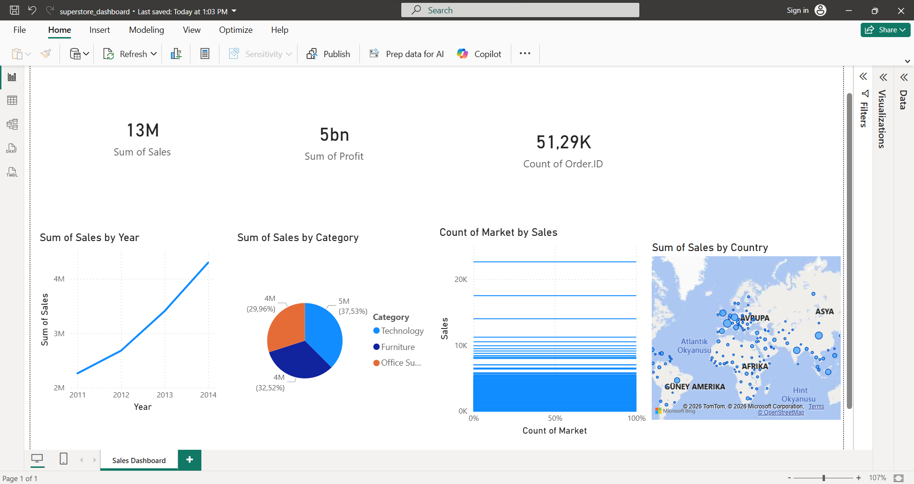

# 📊 Global Superstore Sales Dashboard — Power BI

## 📌 Proje Hakkında
Global Superstore veri seti kullanılarak Power BI'da interaktif bir satış dashboard'u oluşturulmuştur.

## 📈 Dashboard İçeriği
- **13M$** Toplam Satış
- **5bn$** Toplam Kar  
- **51.29K** Toplam Sipariş
- Yıllık satış trendi (2011-2014)
- Kategori bazında satış dağılımı
- Market bazında satış analizi
- Ülke bazında satış haritası

## 💡 Öne Çıkan Bulgular
- Satışlar 2011'den 2014'e sürekli artış gösterdi
- Technology kategorisi en yüksek satışa sahip (%37.53)
- Furniture ve Office Supplies yakın oranlarda

## 🔧 Kullanılan Teknolojiler
- Power BI Desktop
- Global Superstore Dataset (Kaggle)

## 📸 Dashboard Görüntüsü

